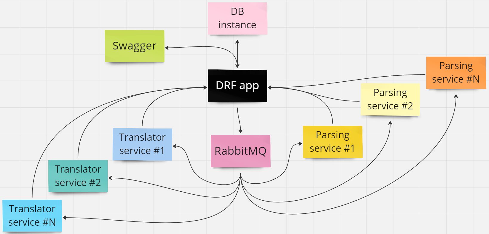

[](https://www.python.org/downloads/release/python-3120/)
<br>

# Markets-Bridge
## Описание
**Markets-Bridge** - B2B система-агрегатор товаров. Основные задачи системы:
1. Спарсить товары из указанного маркетплейса по указанной ссылке;
2. Перевести текстовые данные с иностранного языка (языка маркетплейса) на необходимый пользователю язык (по умолчанию русский).

Товары, которые хранятся в базе системы можно получить по ее доступному [API](https://parser.standard-it.ru/swagger/) (если у вас есть доступ). 
Вследствие этого можно реализовать интеграцию с любой удобной системой 
("OZON", "Wildberries", "Мой склад"), зависимые данные будут всегда обновляться (остатки, цены, наличие).

В системе реализованы регулярные фоновые задачи, записи которых хранятся в базе (т.е. ими можно динамически управлять).

Данная система выстроена так, что DRF приложение (данный репозиторий) является куратором и посредником между сервисами и базой, с небольшой бизнес-логикой.
Всю основную рутину выполняют отдельные от DRF приложения сервисы парсинга и перевода. Примерная схема работы системы:



Доступ к API данного приложения осуществляется по JWT. Каждая единица сервиса должна получать доступ именно таким способом.
Подробнее о [JWT с DRF](https://django-rest-framework-simplejwt.readthedocs.io/en/latest/getting_started.html).

## Установка
### Конфигурация системы
Для функционирования системы необходимы: 
- [PostgreSQL база](https://www.postgresql.org/) (в будущем будет возможность использования любого поддерживаемого движка БД на выбор пользователя);
- [RabbitMQ server](https://www.rabbitmq.com/download.html);
- Python, поддерживаемой версии (разработка велась на 3.12.0).

### Установка проекта
Клонируем проект в необходимую директорию:
```shell
git clone git@github.com:qckzzi/markets-bridge-drf-app.git
```
```shell
cd markets-bridge-drf-app
```
Создадим виртуальное окружение:
```shell
python3 -m venv venv
```
(или любым другим удобным способом)

Активируем его:
```shell
. venv/bin/activate
```
Установим зависимости:

(для разработки)
```shell
pip install -r DEV_REQUIREMENTS.txt
```
(для деплоя)
```shell
pip install -r REQUIREMENTS.txt
```
В корневой директории проекта необходимо скопировать файл ".env.example", переименовать
его в ".env" и заполнить в соответствии с вашей системой.
В том числе необходимо сгенерировать свой SECRET_KEY для django ([Создание SECRET_KEY](https://www.educative.io/answers/how-to-generate-a-django-secretkey)).

Запуск проекта:
```shell
python markets_bridge/manage.py runserver
```
## Разработка

Для внесения изменений в кодовую базу необходимо инициализировать pre-commit git hook.
Это можно сделать командой в терминале, находясь в директории проекта:
```shell
pre-commit install
```
Это необходимо для поддержания 
единого кодстайла в проекте. При каждом коммите будет запущен форматировщик.